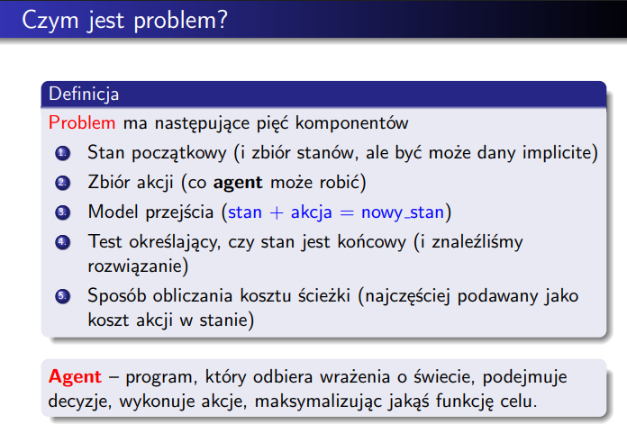

# zad 1
## dokładnie dwa rozwiązania 

|     |  1  |  1  |
| --- | --- | --- |
|  1  |     |     |
|  1  |     |     |

## ponad n rozwiązań

|     |  1  |  1  |  1  |
| --- | --- | --- | --- |
|  1  |     |     |     |
|  1  |     |     |     |
|  1  |     |     |     |
 
3! rozwiazan

# zad 2
szukamy szczególnych przypadków na przykład cała kolumna albo wiersz, w drugiej kolejnosci jak mamy cos bliskiego n to wiekszosc srodkowych bedzie zakolorowana. szukamy takich przypadkow po kazdym ruchu.

# zad 4
a) dla figuranta mamy  
$4*4 = 16 \rightarrow$ ilosc różnych kart
$$\binom{16}{5} = \frac{16!}{5!*11!}$$
b) dla blotkarza mamy 
$ 4*9 = 36 \rightarrow$ ilosc różnych kart
$$\binom{36}{5} = \frac{36!}{5!*31!}$$
wychodzi nam strasznie duzo porownan,
ale mozemy to uproscic do porownywania punktow za uklady

# zad 6

Tworzymy graf skierowany gdzie z wierzchołka startowego wychodzą dwie krawędzie jedna z kosztem 0 i ma $\infty$ nastepnnch krawedzi o koszcie 0, a druga krawedz wychodzaca ma koszt 1 i prowadzi bezposrednio do wierzcholka koncowego

# zad 7
NWW(pozycja gracza, pozcyje wrogów, t)

# zad 8
Sokoban - jesteśmy magazynierem, którego celem jest przepchanie skrzynek na odpowiednie miejsca. Możemy poruszać się tylko w czterech kierunkach a skrzynki można tylko pchać. Gra kończy się, gdy wszystkie skrzynki są na odpowiednich miejscach.

Aby stworzyć optymalniejszy opis przestrzeni ruchów znajdujemy BFSem wszystkie możliwe pozycje które bedą powodowały przesunięcie skrzynki i kierunek w którym bedziemy mogli ją przesunąć.

# zad 9

a) 
1. stan początkowy: (pełny bak, węzeł startowy, węzeł końcowy)
2. zbiór akcji: (tankowanie, przemieszczenie się po krawędzi (tylko jesli mamy odpowiednia ilos paliwa))
3. model przejscia: (przejscie do węzła sąsiedniego, zmiana stanu paliwa)
4. Stan końcowy: (bak dowolony, węzeł końcowy, węzeł końcowy)
5. Sposób obliczania kosztu ścieżki: koszt przejscia do węzła sąsiedniego

b)
1. stan początkowy: (węzeł startowy, paczki i ich węzły docelowe)
2. zbiór akcji: (przemieszczenie sie po krawedzi)
3. model przejscia: (zmiana węzła)
4. Stan końcowy: (brak pozostałych paczek do rozwożenia)
5. Sposób obliczania kosztu ścieżki: (koszt przejscia do węzła sąsiedniego)

# zad 10
ilosc stanów $n^k$ bo mamy k przyjaciół i każdy z nich ma n możliwych stanów czyli $n*n*n*...*n$ k razy

dla problemu b szukamy wierzchołka z największym indegiem i próbujemy dojść do niego każdym przyjacielem jednocześnie. jeśli któryś z przyjaciół osiągnie cel przestaje chodzic
