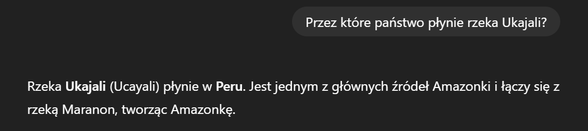

# zad 1

# zad 2
1.  ✅
2.  ✅
3.  ✅
4.  ✅
5.  ✅
# zad 3

Dla długich tekstów taki znak wodny mógłby pozostć niezauważony przy normalny rozkładzie tekstu jednak w przypadku krótiego tekstu słowa na C, S i K mogą wcale się nie pojawić przez co uzycie znaku wodnego traci sens

# zad 4
a) Można (choć to niepraktyczne) podać jako kontekst wszystkie słowa w prompcie.
Najlepiej wygenerować top k słów i samplowac z nich.

b) Funkcja prawdopodobieństwa może pomóc w rankingowaniu kandydatów, ale nie daje pewności wyboru semantycznie poprawnego słowa. Wymagałoby to kombinacji z filtrowaniem słownika lub dodatkowym semantycznym modelem dopasowania.

# zad 5
1. preprocessing prefixu: prefix powinien kończyć się po pełnym wyrazie i na końcu powinna być spacja żeby model wiedział że oczekujemy kolejnego słowa
2. ograniczamy liczbę tokenów do 3 (rzadko będzie to dłuższe słowo)
3. postprocessing: usuwanie dodatkowych spacji/znaków przestankowych z wygenerowaneego tekstu
4. dodatkowo jeśli ostanie słowo nie jest kompletne uzupełeniamy po jednym tokenie

# zad 6
Konkluzje: nie uzywac gpt 2
rasizm, seksizm
# zad 7

# zad 8

### Scenariusz 1 – Model „kaskadowy"

**Opis:** Jeden model generuje wstępny szkic tekstu, a drugi model go dopracowuje lub przetwarza dalej.

**Proces:** Model A generuje surowy tekst lub streszczenie.
Tekst jest przesyłany do Modelu B, który wykonuje np. poprawki stylistyczne, uzupełnienia faktów lub tłumaczenie.

### Scenariusz 2 - Model równoległy z agregacją wyników

**Opis:** Oba modele generują niezależnie tekst na podstawie tego samego promptu, a następnie wyniki są agregowane lub wybierany jest najlepszy wariant.

**Proces:** Model A generuje tekst w swojej stylistyce i słownictwie.
Model B generuje tekst niezależnie.
Mechanizm wyboru np. scoringu, głosowania lub klasyfikatora wybiera najlepiej dopasowany tekst.

### Scenriusz 3 - Model hybrydowy z różnymi tokenizacjami

**Opis:** modele mają różne tokenizacje i przesyłają sobie zdekowane stringi i same je tokenizują

**Proces:** Model A tokenizuje prompt generuje token i zwraca odpowiedz w formie tekstu. Model B przyjmuje tekst z modelu A i robi to samo co model A tylko innym tokenizatorem

# zad 9
Zamiast generować całe $N$-wyrazowe zdania i dopiero potem je oceniać, będziemy budować zdania słowo po słowie. Na każdym kroku będziemy śledzić tylko $K$ najbardziej obiecujących (najbardziej prawdopodobnych) fragmentów zdań.