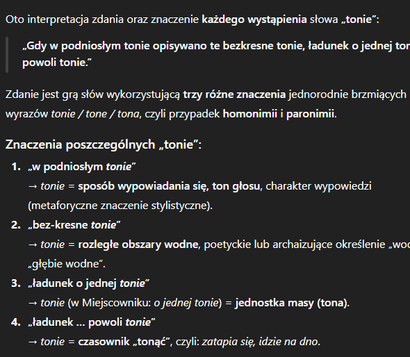

# zad 1
### tonie - tonąć
### tonie - tona
### tonie - ton
### tonie - toń
„Gdy w podniosłym tonie opisywano te bezkresne tonie, ładunek o jednej tonie powoli tonie."

# zad 2

# zad 3
a) klasyczny softmax czy zdanie A może wystąpić po zdaniu B (jakie jest prawdopodobieństwo)
b) możemy zrobić to samo tylko przetestować jeszcze prawdopdobieństwo w drugą stronę i jesli bedzie ono wieksze to odrzucamy

a) bez sieci neuronowych
Zamieniamy oba zdania na wektory liczbowe za pomocą word2vec i liczymy ich odległość cosinusową
używamy klasyfikatora np. regresja logistyczna

# zad 4

# zad 8
Augmentacja danych -> sztuczne powiększanie zbioru treningowego
1. Parafrazowanie (zachowanie znaczenia zmiana formy)
- prompt: Przepisz poniższą recenzję innymi słowami, zachowując ten sam wydźwięk i sens
2. Zmiana stylu
- prompt: Przepisz tę formalną recenzję tak, jakby napisał ją zdenerwowany nastolatek używający potocznego języka
3. Inwersja sentymentu (zmiana na przeciwną opinie)
- prompt: Zmień wydźwięk tej recenzji na przeciwny (z pozytywnego na negatywny), zachowując te same aspekty produktu

# zad 9
1. Reprezentacja zagadki: Dla danej zagadki usuwamy słowa przystankowe (stop words) i obliczamy średnią (centroid) z wektorów wszystkich pozostałych słów tworzących zagadkę. Otrzymujemy wektor $V_{zagadki}$. Szukanie kandydata: Obliczamy podobieństwo kosinusowe między $V_{zagadki}$ a wektorami wszystkich możliwych słów w słowniku (lub ograniczonego zbioru kandydatów). Wynik: Słowo, którego wektor jest najbliżej wektora zagadki, wygrywa.
2. Przetworzenie bazy wiedzy: Dla każdego słowa w słowniku pobieramy jego wzorcową definicję. Obliczamy wektor tej definicji (uśredniając wektory słów w niej zawartych), tworząc bazę par: $(Słowo, V_{definicji})$.Reprezentacja zagadki: Analogicznie obliczamy wektor dla treści nowej zagadki $V_{zagadki}$.Dopasowanie: Szukamy w bazie takiej definicji, której wektor $V_{definicji}$ jest najbardziej podobny (kosinusowo) do wektora zagadki $V_{zagadki}$.Wynik: Zwracamy słowo przypisane do najlepiej pasującej definicji.
3. Przeszukujemy zbiór przeszłych zagadek z opdowiedziami najbliższcyh wektorowo (np kNN)
Wybieramy k najbliższych i patrzymy która z ich odpowiedzi ma najwieksze prawdopodobienstwo wystąpienia